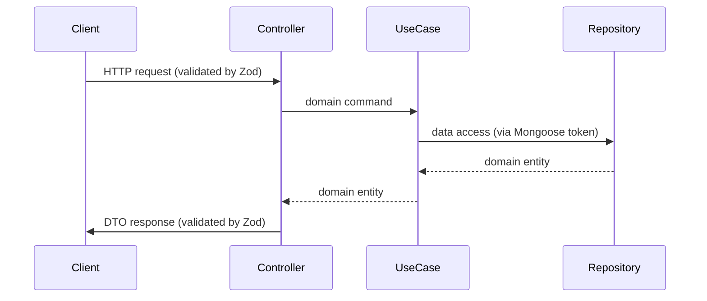

Project Architecture
====================

This document explains the high-level architecture, key patterns, module layout and operational guidance for contributors. It is a concise companion to the detailed conventions in `AGENTS.md`.

Table of contents
-------

- Overview
- Architectural principles
- Layers and responsibilities
- Mappers
- Bounded contexts and module layout
- Data flow (request → response)
- Dependency Injection & repository pattern
- Validation, DTOs and OpenAPI
- Testing strategy and quality gates
- Branching
- Commits
- Pre-commit hooks
- Pull requests
- Continuous Integration
- Deployment & acceptance tests
- Where to find important files
- Diagrams
- Closing notes

Overview
-------

`goat-it-api` is a TypeScript (NestJS) HTTP API using the Fastify adapter, MongoDB (Mongoose) and Zod for DTO validation. The project follows Hexagonal Architecture (Ports & Adapters) coupled with Domain-Driven Design (DDD) and strict test quality rules.

Architectural principles
-------

- Hexagonal / Ports & Adapters: Domain layer is independent from infrastructure.
- DDD by bounded contexts: domain entities, value objects, repository interfaces live in `src/contexts/<context>/.../domain`.
- Single responsibility: controllers are thin; use cases contain business logic.
- Test quality enforced: unit tests colocated with source files, 100% coverage, mutation testing with Stryker.
- Path aliases used throughout (see `configs/swc/swc.config.json` and `configs/typescript/*`).
- Symbol-based injection tokens for repository interfaces to avoid collisions.

Layers and responsibilities
-------

1. Domain (pure)
-------

   - Location: `src/contexts/<context>/modules/<feature>/domain/`
   - Contents: entities, value-objects, repository interfaces (ports), domain errors.
   - No external deps, throws domain-specific errors.

2. Application
-------

   - Location: `.../application/`
   - Contents: use-cases, DTO definitions (Zod), mappers.
   - Orchestrates domain logic by calling repository ports.

3. Infrastructure (adapters)
-------

   - Location: `.../infrastructure/`
   - Subareas:
     - HTTP controllers: `.../http/controllers/` — map HTTP ↔ use-cases.
     - Persistence: `.../persistence/mongoose/` — Mongoose schemas, repository implementations, document↔entity mappers.
     - Auth, config, logging, server bootstrap in `src/infrastructure/api/`.

Mappers
-------

Mappers are small, focused functions responsible for converting between different representations used across layers:

- Persistence Document → Domain Entity
- Domain Entity → DTO (response)
- DTO (request) → Domain Command
- Persistence mappers: `src/contexts/<context>/modules/<feature>/infrastructure/persistence/mongoose/mappers/`.
- DTO mappers: `src/contexts/<context>/modules/<feature>/application/mappers/`.
- Files should be named `<entity>.mongoose.mappers.ts` and `<entity>.dto.mappers.ts`.

Guidelines

- Keep mappers pure and deterministic; no side effects.
- Map only allowed and necessary fields; prefer explicit assignments to avoid accidental property forwarding.
- Centralize date and timezone conversions in mappers (e.g., document.createdAt → entity.createdAt as JS Date).
- Normalize optional fields and provide sensible defaults in mapping layer, not in controllers.
- Write unit tests for mappers that cover edge cases (missing fields, legacy shapes, null/undefined values).

Bounded contexts and module layout
-------

- Root: `src/contexts/<context>/`
- Each feature: `modules/<feature>/` with the 3 layers above.
- Feature module pattern: `<feature>.<type>.ts` (e.g. `question-theme.module.ts`).
- Module wiring: register Mongoose schemas using `MongooseModule.forFeature(...)` and provide use-cases and repository providers with injection tokens.

Data flow (request → response)
-------

1. Client request hits a controller in `infrastructure/http/controllers`.
2. Controller validates input with Zod DTOs (via `nestjs-zod`) and pipes (e.g. `MongoIdPipe`).
3. Controller maps request DTO → domain command and calls the appropriate use-case.
4. Use-case contains business logic and calls repository (injected token) which returns domain entities.
5. Controller maps domain entity → response DTO and returns it.
6. Errors: domain errors are thrown and converted to HTTP exceptions by `GlobalExceptionFilter`.

Dependency Injection & repository pattern
-------

- Define repository interfaces in domain: `*.repository.types.ts`.
- Define injection tokens as Symbols: `export const MY_REPO_TOKEN = Symbol('MyRepo')`.
- Implement repository in infrastructure (Mongoose) and register provider:

```ts
const providers = [
  { 
    provide: MY_REPO_TOKEN, 
    useClass: MyRepoMongooseRepository, 
  },
]
```

- Use `@Inject(MY_REPO_TOKEN)` in use-cases to obtain repository implementation.

Validation, DTOs and OpenAPI
-------

- All response DTOs use Zod with `z.strictObject(...)` and `.describe()` for properties to enable `nestjs-zod` OpenAPI generation.
- Request DTOs use `z.object(...)` where the code intentionally allows additional properties; controllers map only allowed fields to domain commands.
- Shared Zod validators live under `src/shared/infrastructure/http/zod/validators/`.
- Controllers use `@ZodResponse()` to document response types.

Testing strategy and quality gates
-------

- Unit tests colocated with source as `*.spec.ts`.
- Faketories live under `tests/shared/utils/faketories/`.
- Mocks under `tests/unit/utils/mocks/`.
- Coverage: 100% enforced (`pnpm run test:unit:cov`).
- Mutation testing via Stryker (configs in `configs/stryker/`).
- Acceptance tests: Cucumber + Dockerized MongoDB; feature files under `tests/acceptance/features/`.
- Pre-commit hooks and CI run linters (`Oxlint`, `ESLint`), typecheck (`pnpm run typecheck`), unit tests and mutation tests.

Branching
-------

- Branch naming pattern: `<type>/<scope>-<short-desc>` where `type` is one of `feat`, `fix`, `docs`, `test`, `chore`, `style`, `refactor`, `perf`, `build`, `ci`, `revert`.
- Example: `feat/add-user-endpoint`.

Commits
-------

- Follow Conventional Commits: `<type>(<scope>): <short description>`.
- `commitlint` runs as a pre-commit check to enforce the format.

Pre-commit hooks
-------

- Husky runs staged checks in this order: `pnpm run typecheck`, branch name validation, `pnpm run lint:staged:fix`, and `pnpm run test:unit:staged`.

Pull requests
-------

- Keep PRs small and single-purpose. Include the summary, testing steps and any required migration notes.
- Add a reviewer and label the PR with appropriate type (e.g., `chore`, `feat`).

Continuous Integration
-------

- CI validates: install, build, lint (Oxlint + ESLint), typecheck, unit tests with coverage, mutation tests and acceptance tests where relevant.
- PRs must pass CI gates before merging.
- Workflows defined in `.github/workflows/`.

Deployment & acceptance tests
-------

- Server bootstrap: `src/main.ts` → `src/infrastructure/api/server/server.ts`.
- Environment variables documented in `AGENTS.md` and `./env/.env.example`.
- Docker builds: `pnpm run docker:build`.
- Acceptance test runner builds the app (unless `SKIP_BUILD=true`), starts test DB containers and runs Cucumber scenarios.

Where to find important files
-------

- App entry: `src/main.ts`
- Server bootstrap & Swagger: `src/infrastructure/api/server/server.ts`
- App module: `src/app/app.module.ts`
- Configs: `configs/` and `configs/swc/swc.config.json`
- Tests: `tests/unit`, `tests/acceptance`
- Faketories / Mocks docs: `docs/FAKETORIES.md`, `docs/MOCKS.md`
- Workflows: `.github/workflows/`

Diagrams
-------



Closing notes
-------

This doc is intentionally concise and intended as a living overview. For low-level conventions, examples and the full contributor rules, consult `AGENTS.md` and the `configs/` directory.
